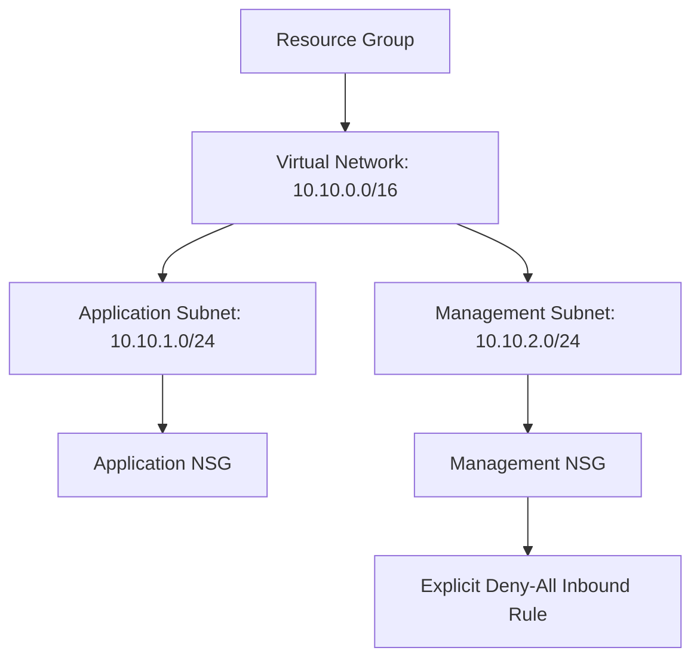

# Azure Terraform Network Lab

A hands-on Infrastructure as Code project built with Terraform and Microsoft Azure.

## What this project creates

- Azure Resource Group
- Virtual Network (VNet)
- Application Subnet
- Network Security Group (NSG)
- NSG association with the application subnet
- Management Subnet
- Application Network Security Group (NSG)
- Management Network Security Group (NSG)
- Explicit Deny-All inbound rule for the management subnet

## Architecture

```text
Resource Group
└── Virtual Network: 10.10.0.0/16
    ├── Application Subnet: 10.10.1.0/24
    │   └── Application NSG
    └── Management Subnet: 10.10.2.0/24
        └── Management NSG
```



## Tools Used

- Terraform
- Microsoft Azure
- Azure CLI
- Git
- GitHub
- Visual Studio Code

## How to Run
- terraform init
- terraform fmt
- terraform validate
- terraform plan
- terraform apply

## Verification
- terraform state list
- terraform output

## Learning Outcomes
- Created Azure infrastructure using Terraform.
- Used Terraform state to track deployed resources.
- Used resource references to connect Azure resources.
- Published the project source code to GitHub using Git.
- Created and applied an Azure NSG security rule using Terraform.
- Learned that NSG rules are evaluated in priority order.